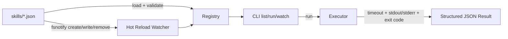

# ⚙️ AI Agent Skills Demo (Go)

[](https://github.com/dsantoreis/ai-agent-skills-demo/actions/workflows/ci.yml)
[](https://goreportcard.com/report/github.com/dsantoreis/ai-agent-skills-demo)
[](https://go.dev)

> Production-style demo of an **AI Skill Registry + Executor CLI** with:
> schema validation, structured execution output, timeouts, and hot-reload from disk.

## Hero

Run local skills as JSON-defined contracts, reload them on file change, and execute safely with deterministic machine-readable output.

## System Flow



## Quickstart (3 commands)

```bash
go test ./...
go run ./cmd/skillsd list --skills-dir ./examples/skills
go run ./cmd/skillsd run --skills-dir ./examples/skills --name echo --input "hello"
```

## Skill schema

```json
{
  "name": "echo",
  "description": "Echoes payload",
  "command": "/bin/sh",
  "args": ["-c", "cat"],
  "env": {"FOO": "bar"},
  "timeout_ms": 1000
}
```

Required fields:
- `name`
- `command`

## CLI

```bash
skillsd list  --skills-dir ./examples/skills
skillsd run   --skills-dir ./examples/skills --name echo --input "hello"
skillsd watch --skills-dir ./examples/skills
```

## Project layout

```text
cmd/skillsd/
internal/skill/
internal/registry/
internal/executor/
internal/watcher/
tests/
docs/
.github/workflows/
```

## Docker

```bash
docker compose up --build
```

## Test coverage focus

- Registry load/list
- Malformed skill validation failure
- Executor success
- Executor timeout
- Watcher hot-reload integration
