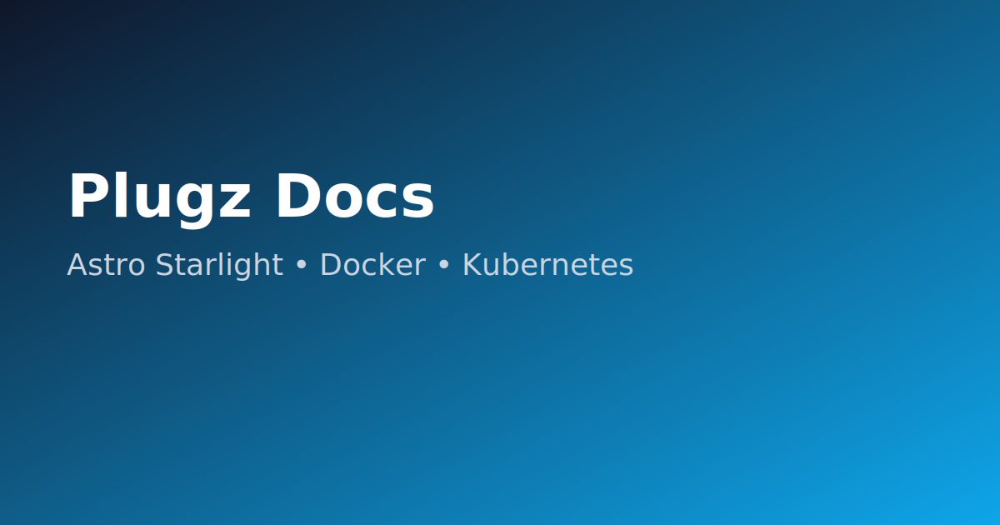

# Plugz Docs — Conversão para Astro Starlight




Documentação migrada para **Astro + Starlight** para navegação rápida e deploy simples.

## Quickstart

```bash
npm ci
npm run dev
# http://localhost:4321
```

## Build

```bash
npm run build
npm run preview
```

## Docker

```bash
docker build -t plugz-docs:latest .
docker run --rm -p 4321:4321 plugz-docs:latest
```

## Kubernetes

```bash
kubectl apply -f k8s/
```

## CI

Workflow em `.github/workflows/docs-site.yml` valida `npm ci` + `npm run build` em push/PR.

Ajuste o host em `k8s/ingress.yaml` antes do deploy em produção.
